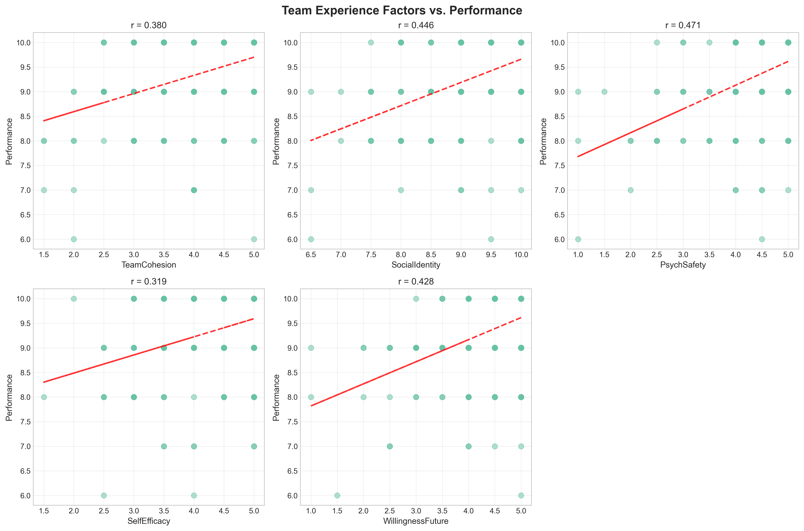
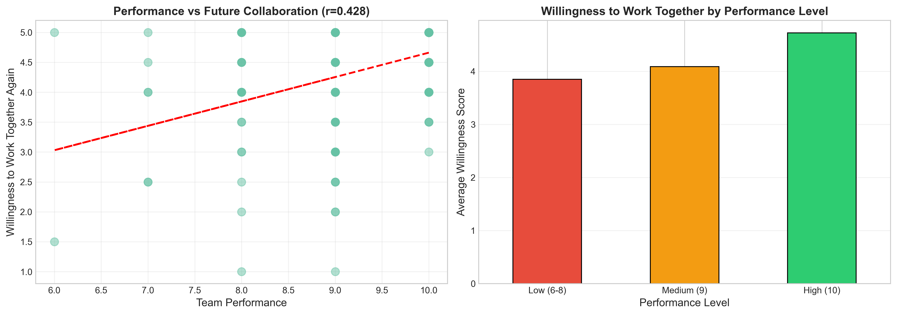
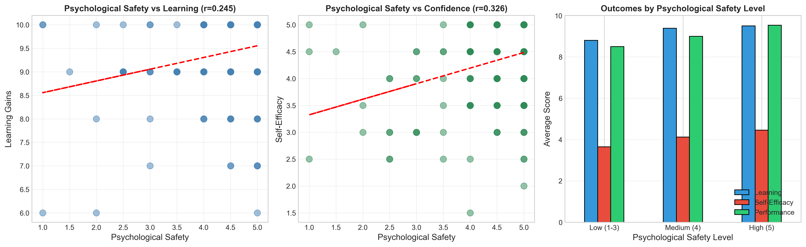
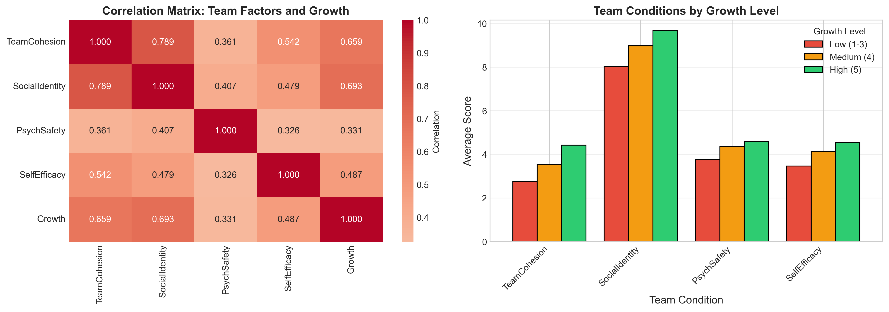
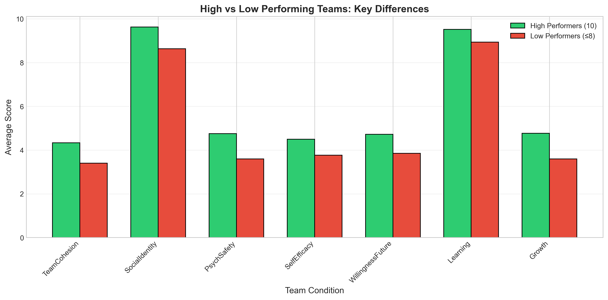
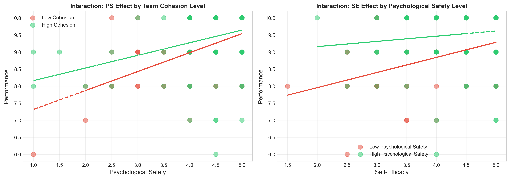
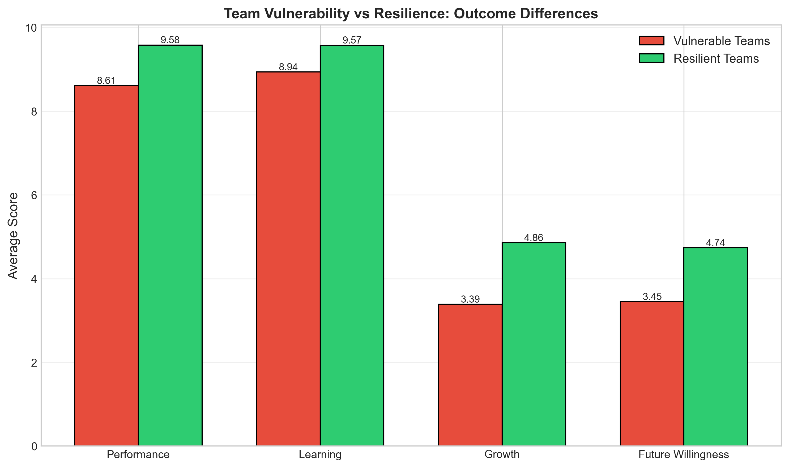

## Team Experience Analysis Report

### Understanding Team Conditions That Drive Performance, Learning, and Growth

**Date:** January 14, 2026
**Dataset:** 210 student survey responses from IS 415
**Analysis Team:** Nathan Trotter, Jake Gunnell, Jazzive Vizcarra, and George Ramsay

---

## Executive Summary

This report analyzes survey responses from 210 students reflecting on their team experiences from the previous semester. The goal is to identify which **reported team conditions** are most strongly **associated** with positive outcomes in performance, learning, and growth—and to translate those patterns into actionable recommendations for improving future team formation and support strategies.

All findings are based on **cross-sectional, self-reported survey data**. Results should be interpreted as **associations**, not proof of causation. Throughout the report we use terms like “predictor” only in the **statistical/modeling** sense (variables that are strongly associated with outcomes or help explain variance), while recognizing that reverse causality and unmeasured factors may also contribute.

### Key Findings

1. **Psychological Safety shows the strongest association with perceived team performance among the factors examined** (r = 0.47). Students who reported feeling safer to take interpersonal risks (e.g., admitting mistakes, asking questions) also tended to report higher-quality team output. This is a substantial relationship in this dataset, but not definitive evidence that psychological safety alone causes better performance.

2. **Higher-performing teams are much more likely to want to work together again.** 87% of students reporting “excellent” performance (10/10) also reported high willingness to collaborate again, compared to 43% among lower-performing teams—suggesting performance quality and team satisfaction commonly move together (with meaningful exceptions).

3. **Psychological Safety is positively related to learning and confidence.** Students in higher-PS teams reported higher learning and self-efficacy on average (learning +8%, self-efficacy +22% vs. low-PS teams). These differences support the practical value of creating environments where students feel comfortable experimenting and surfacing uncertainty.

4. **Social Identity and Team Cohesion show the strongest associations with reported improvement over time** (r = 0.69 and r = 0.66). Students who reported stronger “we-ness” and interpersonal bonding also tended to report greater growth across the semester—though growth is measured retrospectively, and other factors (project structure, instructor feedback, workload) may also shape these perceptions.

### Strategic Implications

These findings suggest that **early-semester support should explicitly foster psychological safety and social bonding**, rather than focusing only on skill matching or workload distribution. Practical levers include structured team-building, explicit norms around mistake tolerance and feedback, and early intervention for teams showing low cohesion and low psychological safety.

---

## Quick Action Guide (1 page)

**What to prioritize**

* Psychological safety for near-term performance; social identity for improvement over time.
* Early detection of vulnerable profiles (low safety + low cohesion in Weeks 2–3).
* Differentiated support: PS-building for low-cohesion teams; identity-building for moderate-PS teams.

**Actions by week**

* Week 1: 60–90 minutes on identity-building (team name, shared goals, norms on mistakes and feedback).
* Weeks 2–3: 3-item pulse (PS, cohesion, identity); flag teams <3.5 on both PS and cohesion.
* Weeks 4–5: Targeted coaching for flagged teams; light-touch retros for others.
* Week 8: Repeat pulse; adjust support; celebrate iteration wins.

**Success metrics**

* Raise flagged teams’ PS and cohesion by +0.5 within 3 weeks.
* Reduce performance gap: <0.5-point difference between vulnerable vs. resilient profiles.
* Future willingness ≥4.2/5 across teams; growth ≥4.3/5.

**Fast interventions**

* Normalize mistakes explicitly and model vulnerability in class.
* Use structured feedback (“I appreciate…, I suggest…”).
* Create identity artifacts (charter, shared values) and reference them in feedback.
* Embed short retros (15–20 minutes) with “keep/stop/start” after major milestones.

---

## 1. Introduction

### Background and Purpose

Faculty use team-based projects to build collaboration skills, deepen learning through peer interaction, and prepare students for professional environments. However, team experiences vary widely. This analysis focuses on:

* Which reported team conditions are most strongly associated with perceived performance and output quality?
* How do those conditions relate to learning gains and confidence development?
* Which conditions are most strongly associated with reported improvement across the semester?

The aim is to inform future team formation, support strategies, and intervention timing.

### Data and Methodology

**Dataset:** 210 anonymized student surveys from IS 415 reflecting on team experiences from the previous semester.

**Key Variables Analyzed:**

* **Team Cohesion (TC):** Interpersonal bonding and connection (Scale 1–5)
* **Social Identity & Belonging (SIB):** Sense of “we-ness” and group membership (Scale 6–10)
* **Psychological Safety (PS):** Comfort taking interpersonal risks and making mistakes (Scale 1–5)
* **Self-Efficacy (SE):** Confidence in skills and abilities (Scale 1–5)
* **Performance (CA):** Perceived quality of team output (Scale 6–10)
* **Learning (RLS):** Perceived learning gains (Scale 6–10)
* **Growth (GO):** Reported improvement over the semester (Scale 1–5)
* **Willingness to Work Together Again (NPS):** Composite/average of items capturing desire to collaborate again (Scale 1–5)

**Analytical Approach:**

* Correlations to identify relationships between variables
* Group comparisons (e.g., high vs. low performance; high vs. low PS)
* Visual exploration of patterns
* Exploratory multivariable regression to compare relative associations when factors are considered together

---

## 2. Analysis 1: Which Team Conditions Are Most Strongly Associated With Performance?

### Research Question

Which team experience factors—cohesion, psychological safety, social identity, confidence, or willingness to collaborate—show the strongest associations with perceived team performance?

### Findings

**Table 1: Correlations with Team Performance**

| Factor                             | Correlation (r) | Statistical Significance |
| ---------------------------------- | --------------- | ------------------------ |
| Psychological Safety               | 0.471           | p < 0.001 ***            |
| Social Identity & Belonging        | 0.446           | p < 0.001 ***            |
| Willingness to Work Together Again | 0.428           | p < 0.001 ***            |
| Team Cohesion                      | 0.380           | p < 0.001 ***            |
| Self-Efficacy                      | 0.319           | p < 0.001 ***            |

*All correlations are statistically significant (p < 0.001).*

**Figure 1:** Scatter plots showing relationships between team experience factors and performance. Red dashed lines indicate linear trends.

### Interpretation

Psychological Safety shows the strongest association with perceived team performance (r = 0.47), followed by Social Identity (r = 0.45) and Willingness to Work Together Again (r = 0.43).

1. **Environment appears closely tied to performance.** Students reporting higher psychological safety also tend to report higher output quality. As a rough interpretation, r = 0.47 implies ~22% shared variance between PS and performance in this dataset.

2. **Belonging also matters.** Students reporting stronger social identity (“we-ness”) tend to report higher performance. This may reflect coordination benefits, motivation, or commitment—but causal direction cannot be determined from this design.

3. **Confidence is related but less central than team climate.** Self-efficacy correlates with performance (r = 0.32), but more weakly than PS and identity. This suggests that individual confidence may support performance, but team dynamics and norms are strongly related as well.

### Key Takeaway

Within the limits of correlational, self-report data, **psychological safety and social identity appear to be high-leverage conditions associated with stronger perceived performance**. In practical terms, early norms that normalize mistakes, encourage questions, and build trust are plausible targets for improvement—alongside attention to task design and support.

---

## 3. Analysis 2: Do High-Performing Teams Want to Work Together Again?

### Research Question

Are teams reporting strong performance also likely to report high willingness to work together again?

### Findings

**Correlation:** r = 0.428 (p < 0.001)
(Approximately 18% shared variance between performance and willingness.)

**Table 2: Performance vs. Willingness to Collaborate Again**

| Performance Level | % High Willingness (5/5) | % Medium Willingness (4/5) | % Low Willingness (≤3/5) |
| ----------------- | ------------------------ | -------------------------- | ------------------------ |
| High (10/10)      | 87.5%                    | 11.6%                      | 0.9%                     |
| Medium (9/10)     | 50.0%                    | 32.4%                      | 17.6%                    |
| Low (≤8/10)       | 43.3%                    | 30.0%                      | 26.7%                    |

**Figure 2:** Left panel shows the relationship between performance and future willingness. Right panel shows average willingness scores by performance level.

### Interpretation

Performance and willingness generally move together in this dataset, with important edge cases:

1. **Most high performers report high willingness, but not universally.** Nearly all 10/10 performance reports also show high willingness, indicating that strong outcomes and positive collaboration often coincide. A small minority deviates, consistent with “high-performing but costly” experiences.

2. **Some lower performers still report strong willingness.** A notable share of low performers report high willingness, suggesting some teams were socially positive but struggled with execution, organization, or task strategy.

3. **Low performance + low willingness is a strong risk signal.** When both performance and willingness are low, it likely reflects broader strain (e.g., conflict, uneven effort, unclear roles). This combination is a practical trigger for support.

### Key Takeaway

For most teams in this dataset, performance and satisfaction reinforce each other. However, edge cases suggest value in diagnosing **both** relational health and task execution to tailor interventions.

---

## 4. Analysis 3: How Does Psychological Safety Relate to Learning?

### Research Question

How does psychological safety relate to learning gains and confidence development?

### Findings

**Correlations:**

* Psychological Safety → Learning: r = 0.245 (p < 0.001)
* Psychological Safety → Self-Efficacy: r = 0.326 (p < 0.001)

**Table 3: Outcomes by Psychological Safety Level**

| PS Level   | Avg Learning | Avg Self-Efficacy | Avg Performance | Sample Size |
| ---------- | ------------ | ----------------- | --------------- | ----------- |
| Low (1–3)  | 8.80 (±1.24) | 3.65 (±0.84)      | 8.50 (±1.00)    | n=20        |
| Medium (4) | 9.39 (±0.64) | 4.12 (±0.81)      | 9.00 (±0.86)    | n=36        |
| High (5)   | 9.50 (±0.79) | 4.45 (±0.65)      | 9.53 (±0.73)    | n=154       |

**Figure 3:** Relationships between psychological safety, learning gains, self-efficacy, and performance.

### Interpretation

Students reporting higher psychological safety also report higher learning and confidence on average, with meaningful variation within each PS band.

1. **Learning increases with PS.** High-PS reports show learning scores about 8% higher than low-PS reports (9.50 vs. 8.80).

2. **Self-efficacy is more sensitive to PS.** High-PS reports show about 22% higher self-efficacy than low-PS reports (4.45 vs. 3.65), consistent with the idea that safe environments support skill practice and risk-taking.

3. **Performance differences are also visible.** High-PS reports average 9.53/10 performance vs. 8.50/10 for low PS.

4. **Most respondents report high PS.** This is encouraging, but the low-PS minority shows consistently weaker outcomes, supporting early identification.

### Key Takeaway

Psychological safety appears linked not only to performance but also to learning and confidence—suggesting practical value in establishing norms that encourage questions, experimentation, and constructive feedback.

---

## 5. Analysis 4: What Team Conditions Are Most Strongly Associated With Growth Over Time?

### Research Question

Which team conditions are most strongly associated with reported improvement across the semester?

### Findings

**Table 4: Correlations with Team Growth Over Time**

| Factor                      | Correlation (r) | Statistical Significance |
| --------------------------- | --------------- | ------------------------ |
| Social Identity & Belonging | 0.693           | p < 0.001 ***            |
| Team Cohesion               | 0.659           | p < 0.001 ***            |
| Self-Efficacy               | 0.487           | p < 0.001 ***            |
| Psychological Safety        | 0.331           | p < 0.001 ***            |

**Table 5: Team Conditions by Growth Level**

| Growth Level | Team Cohesion | Social Identity | Psych Safety | Self-Efficacy |
| ------------ | ------------- | --------------- | ------------ | ------------- |
| Low (1–3)    | 2.75          | 8.02            | 3.77         | 3.46          |
| Medium (4)   | 3.52          | 8.98            | 4.35         | 4.13          |
| High (5)     | 4.42          | 9.68            | 4.59         | 4.54          |

**Figure 4:** Left panel shows correlation matrix. Right panel shows how team conditions differ by growth level.

### Interpretation

Social identity and cohesion show the strongest associations with reported growth (r = 0.69 and r = 0.66).

1. **Belonging aligns strongly with improvement reports.** Students who felt stronger “we-ness” also tended to report more improvement over time.

2. **Relational bonds align with growth.** Higher cohesion is also strongly related to reported growth, consistent with the idea that teams with relational foundations can iterate more effectively.

3. **PS relates to growth but less strongly than to performance.** PS correlates with both outcomes, but the pattern suggests it may be more tightly linked to perceived current performance than to retrospective growth reports in this dataset.

4. **Low-growth profiles show broad weaknesses.** Teams with low growth show lower scores across all conditions, suggesting that multiple issues often co-occur.

### Key Takeaway

If the goal is improvement over time, **identity- and cohesion-building early in the semester** appears especially aligned with higher growth reports—while recognizing that growth ratings are retrospective and likely influenced by context.

---

## 6. Comparative Analysis: High vs. Low Performing Teams

We compared reports of excellent performance (10/10) against lower performance (≤8/10).

**Table 6: High Performers vs. Low Performers**

| Metric                             | High Performers (n=112) | Low Performers (n=30) | Difference |
| ---------------------------------- | ----------------------- | --------------------- | ---------- |
| Team Cohesion                      | 4.33                    | 3.40                  | +0.93      |
| Social Identity                    | 9.63                    | 8.63                  | +1.00      |
| Psychological Safety               | 4.75                    | 3.60                  | +1.15      |
| Self-Efficacy                      | 4.50                    | 3.77                  | +0.73      |
| Willingness to Work Together Again | 4.72                    | 3.85                  | +0.87      |
| Learning                           | 9.52                    | 8.93                  | +0.59      |
| Growth                             | 4.77                    | 3.60                  | +1.17      |

**Figure 6:** Comparison of team conditions between high and low performing teams.

### Interpretation

High-performing teams show higher scores across all dimensions, with the largest differences in psychological safety and growth.

* These differences are meaningful in practical terms, but they should not be interpreted as proving that changing one factor will necessarily produce the observed difference.
* The pattern is consistent with the idea that **multiple supportive conditions tend to cluster together** in stronger team experiences.

---

# PART II: ADVANCED (EXPLORATORY) ANALYSES

This section uses multivariable modeling and subgroup comparisons to deepen interpretation. These analyses are **exploratory and descriptive**, not causal estimates or precise forecasts.

---

## 7. Advanced Analysis 1: Predictive Regression Models (Exploratory)

We built multiple linear regression models to examine which factors remain most strongly associated with outcomes when considered together. Because measures were collected at one time point and key contextual variables are omitted, results should be treated as **model-based association summaries**.

### 7.1 Model Specifications and Variable Coding

* **Outcomes**

  * Performance: CA item (6–10 scale)
  * Growth: GO item (1–5 scale)
* **Predictors (entered simultaneously)**

  * Team Cohesion: mean of TC1, TC2 (1–5)
  * Social Identity: mean of SIB1, SIB2 (6–10)
  * Psychological Safety: mean of PS1, PS2 (1–5)
  * Self-Efficacy: mean of SE1, SE2 (1–5)
* **Estimation details**

  * OLS regression (scikit-learn `LinearRegression`)
  * Predictors standardized (z-scored) so coefficients are comparable
  * No additional covariates included (possible omitted-variable bias)

We did not run a full formal diagnostic workflow (e.g., influence checks, robust regression). Coefficients should be interpreted as **relative importance within this model**, not precise effect sizes.

### Model 1: Predicting Team Performance

**R² = 0.304** (30.4% of performance variance explained)

**Standardized Coefficients:**

* Psychological Safety: 0.2837
* Social Identity: 0.2280
* Self-Efficacy: 0.0673
* Team Cohesion: 0.0037

**Interpretation:** Psychological safety and social identity remain the most prominent factors in the multivariable model. Cohesion’s association appears largely overlapping with identity in this specification (i.e., once identity is included, cohesion adds little unique linear association).

### Model 2: Predicting Team Growth

**R² = 0.531** (53.1% of growth variance explained)

**Standardized Coefficients:**

* Social Identity: 0.4380
* Team Cohesion: 0.2344
* Self-Efficacy: 0.1512
* Psychological Safety: 0.0248

**Interpretation:** Growth shows a different structure than performance, with identity and cohesion most prominent. Psychological safety appears less uniquely associated with growth once other factors are included in the same model.

**Figure 8:** Standardized coefficients for performance and growth models.

---

## 8. Advanced Analysis 2: Interaction-Style Subgroup Patterns (Exploratory)

Rather than estimating formal interaction terms in a single regression, we explored patterns by computing correlations within subgroups (e.g., splitting at the median of cohesion). These are **indicative patterns** only.

### Psychological Safety × Team Cohesion

**Question:** Does psychological safety matter more when cohesion is low?

**Findings (Exploratory):**

* **Lower Cohesion subgroup:** PS → Performance r = 0.576 (n=73 respondents)
* **Higher Cohesion subgroup:** PS → Performance r = 0.344 (n=137 respondents)

**Interpretation:** Psychological safety appears more strongly related to performance in lower-cohesion contexts, consistent with a “compensation” pattern (PS may matter more when interpersonal bonding is weaker). This is suggestive, not definitive, without formal moderation tests.

### Self-Efficacy × Psychological Safety

**Question:** Does confidence relate differently to performance depending on PS?

**Findings (Exploratory):**

* **Lower PS subgroup:** SE → Performance r = 0.402 (n=56 respondents)
* **Higher PS subgroup:** SE → Performance r = 0.134 (n=154 respondents)

**Interpretation:** One plausible explanation is a ceiling/constraint effect: in high-PS contexts, confidence varies less and performance is generally higher, so SE differentiates outcomes less. Alternative explanations are possible and cannot be adjudicated here.

**Figure 7:** Subgroup patterns showing how associations differ across conditions.

---

## 9. Advanced Analysis 3: How Might These Factors Work Together? (Mechanism Thinking, Qualitative)

This section offers plausible interpretations consistent with the patterns above and prior team research. These are **hypotheses**, not proven causal pathways.

### 9.1 Psychological Safety, Confidence, and Team Process

A conservative interpretation consistent with the data:

* In safer environments, students may be more willing to ask questions, admit gaps, and share ideas.
* These behaviors may support both better team processes (error correction, feedback exchange) and higher confidence over time.

The current design does not support quantifying how much of the association operates through each pathway.

### 9.2 Social Identity, Cohesion, and Growth

A plausible mechanism story:

* Strong “we-ness” may increase commitment to shared improvement and reduce friction in coordination.
* Cohesion may make difficult conversations and accountability more sustainable across a semester.

Again, these are interpretive explanations rather than measured causal pathways.

### 9.3 Using Mechanism Thinking Carefully

In this report we:

* Treat mechanism stories as **interpretations**, not proof
* Avoid quantified “percent mediated” claims given the single-survey design
* Emphasize that multiple mechanisms and contextual factors likely operate simultaneously

---

## 10. Advanced Analysis 4: Vulnerability & Resilience Patterns

We identified “vulnerable” and “resilient” profiles based on combinations of low vs. high protective factors. Mixed profiles also exist (e.g., high PS but low cohesion).

### Team Profiles

**Vulnerable Profile** (Low PS AND Low Cohesion): n=31 respondents (15%)

* Average Performance: 8.61/10
* Average Learning: 8.94/10
* Average Growth: 3.39/5
* Future Willingness: 3.45/5

**Resilient Profile** (High PS AND High Cohesion): n=112 respondents (53%)

* Average Performance: 9.58/10
* Average Learning: 9.57/10
* Average Growth: 4.86/5
* Future Willingness: 4.74/5

**Performance Gap:** 0.97 points (~11% of the 6–10 range)
**Growth Gap:** 1.47 points (~43% of the 1–5 scale range)

### Interpretation

* Vulnerable profiles show meaningful gaps across outcomes, especially growth and willingness.
* Even vulnerable teams report moderate performance on average, suggesting other factors can partially compensate (task clarity, individual skill, course structure).
* Mixed profiles are useful for targeting support (e.g., PS-building vs. cohesion/identity-building depending on the weak dimension).

**Figure 9:** Vulnerable vs. resilient profiles.

---

## 11. Exploring Alternative Explanations (Conservative Interpretation)

### Alternative 1: Team capability confound

**Concern:** Unmeasured capability could drive both higher PS and higher performance.
**What we can say from this dataset:** Self-efficacy (a partial proxy) is related to performance (r = 0.319), but PS is more strongly related (r = 0.471) and remains prominent in multivariable modeling.
**Conclusion:** These patterns are consistent with PS having an association beyond confidence alone, but confounding remains plausible.

### Alternative 2: Shared method variance

**Concern:** A single self-report survey can inflate correlations (halo effects, mood, etc.).
**What we can say:** Multiple constructs use different scale ranges and the pattern of relationships is not uniform across variables, which slightly reduces (but does not eliminate) shared-method concerns.
**Conclusion:** Common-method bias may inflate some relationships; interpret effect sizes conservatively.

### Alternative 3: Temporal ordering / reverse causality

**Concern:** High performance could increase perceived PS and cohesion, rather than the reverse.
**What we can say:** Because the design is cross-sectional and retrospective, bidirectionality is plausible (e.g., better outcomes may reinforce better feelings about the team).
**Conclusion:** Likely a reinforcing cycle rather than a one-way causal chain.

---

## 12. Summary of Key Variables

**Table 7: Descriptive Statistics**

| Variable             | Mean | Std Dev | Min | Max  | Range |
| -------------------- | ---- | ------- | --- | ---- | ----- |
| Team Cohesion        | 4.03 | 0.88    | 1.5 | 5.0  | 3.5   |
| Social Identity      | 9.33 | 0.80    | 6.5 | 10.0 | 3.5   |
| Psychological Safety | 4.44 | 0.83    | 1.0 | 5.0  | 4.0   |
| Self-Efficacy        | 4.32 | 0.74    | 1.5 | 5.0  | 3.5   |
| Performance          | 9.34 | 0.85    | 6.0 | 10.0 | 4.0   |
| Learning             | 9.41 | 0.84    | 6.0 | 10.0 | 4.0   |
| Growth               | 4.43 | 1.02    | 1.0 | 5.0  | 4.0   |
| Willingness (Future) | 4.39 | 0.81    | 1.0 | 5.0  | 4.0   |

---

## 13. Recommendations and Implications for Decision-Makers

### Recommendation 1: Diagnose Early and Intervene for Vulnerable Profiles

**Rationale:** Low-PS + low-cohesion profiles show weaker outcomes, especially growth and willingness.
**Action steps:**

* Week 2 pulse: 2–3 items (PS, cohesion, identity)
* Flag: <3.5/5 on both PS and cohesion
* Provide targeted coaching within 1–2 weeks
* Re-check at Week 4–5 to track movement

### Recommendation 2: Differentiate Support by Profile

**Low Cohesion, Moderate PS:**

* Focus: identity and bonding (shared goals, early wins, roles, norms)

**Low PS, Moderate Cohesion:**

* Focus: explicit PS norms (mistakes, disagreement, structured feedback)

**High PS, High Cohesion:**

* Focus: continuous improvement (retros, iteration, conflict skill-building)

### Recommendation 3: Build Psychological Safety With Concrete Practices

* Normalize mistakes explicitly (and model it)
* Use structured feedback routines
* Embed error-catching processes (peer review, checklists)
* Teach disagreement norms (critique ideas, not people)

### Recommendation 4: Prioritize Identity Building for Improvement Over Time

* Week 1 identity investment (name, shared goals, working agreement)
* Create and use identity artifacts (charter, shared values)
* Tie feedback to identity commitments (“your agreement says…”) rather than personality

### Recommendation 5: Frame Teamwork as Improvement, Not Only Delivery

**Rationale:** Team condition factors are more tightly associated with growth than with performance in this dataset (R² 0.53 vs. 0.30 in exploratory models).
**Action steps:**

* Mid-semester retros at Week 4 and Week 8
* Include a small graded component for reflection/improvement behaviors
* Provide lightweight frameworks for role clarity and conflict repair
* Recognize iteration wins publicly

---

## 14. Limitations and Future Research

### Limitations

1. **Self-reported measures:** Subject to halo effects, mood, and perception bias; however, student experience is itself an important outcome.
2. **Cross-sectional and single-source:** Associations only; causality and direction cannot be established; common-method variance may inflate some relationships.
3. **Single-semester snapshot:** Longitudinal measurement across multiple checkpoints would strengthen conclusions.
4. **Context-specific:** Findings may vary by course design, discipline, project type, and cohort.
5. **Unexplained variance:** A substantial portion of outcomes is likely driven by task design, instructor feedback, skills, and workload factors not measured here.

### Future Research Opportunities

* Intervention trials (PS-building and identity-building)
* Longitudinal pulses (Week 1/4/8/15)
* Qualitative interviews for edge-case teams
* Moderation by team composition (prior friendships, diversity, experience)
* Compare self-report outcomes with objective performance indicators

---

## 15. Conclusion

This analysis suggests that perceived team outcomes are systematically related to specific reported conditions—particularly psychological safety, social identity, and cohesion.

1. Psychological safety shows the strongest association with perceived performance in this dataset (r = 0.47; β ≈ 0.28 in the exploratory model).
2. Social identity shows the strongest association with reported growth over time (r = 0.69; β ≈ 0.44 in the exploratory model).
3. Subgroup patterns suggest psychological safety may matter more when cohesion is low, supporting targeted early intervention for vulnerable profiles.
4. The most practical implication is that **small, intentional investments early in the semester** (norms, identity-building, feedback structure) are plausibly linked to better student-reported outcomes—and may be easier to implement than late-stage remediation.

Recommended implementation priorities:

1. Measure team conditions early and repeat briefly mid-semester
2. Segment support by profile (PS vs. identity/cohesion needs)
3. Use short, structured routines (feedback formats, retrospectives) as default scaffolding
4. Treat teamwork as an improvement process, not only a deliverable

---

## Appendices

### Appendix A: Variable Definitions

* **Team Cohesion (TC):** Mean of items measuring interpersonal bonding and emotional connection (1–5).
* **Social Identity & Belonging (SIB):** Mean of items measuring “we-ness” and group membership (6–10).
* **Psychological Safety (PS):** Mean of items measuring comfort with interpersonal risks and mistakes (1–5).
* **Self-Efficacy (SE):** Mean of items measuring confidence in personal contribution and skills (1–5).
* **Performance (CA):** Perceived output quality (6–10).
* **Learning (RLS):** Perceived learning gains (6–10).
* **Growth (GO):** Perceived improvement over the semester (1–5).
* **Willingness to Work Together Again (NPS):** Composite/average of items measuring desire to collaborate again (1–5).

### Appendix B: Statistical Significance

All correlations reported are statistically significant at p < 0.001 unless noted. Regression models use standardized predictors for relative coefficient comparison.

### Appendix C: Advanced Analytical Methods

* **Regression:** Multiple linear regression with standardized predictors (exploratory).
* **Subgroup patterns:** Median splits to compare correlations across contexts (exploratory; not formal interaction tests).
* **Profile segmentation:** High/low PS × high/low cohesion profiles to flag vulnerable vs. resilient patterns.

### Appendix D: Files Generated

**Figures:**

* Fig1_Performance_Correlations.png
* Fig2_Performance_vs_Willingness.png
* Fig3_PsychSafety_Learning.png
* Fig4_Growth_Predictors.png
* Fig5_Full_Correlation_Matrix.png
* Fig6_High_vs_Low_Performers.png
* Fig7_Interaction_Effects.png
* Fig8_Regression_Models.png (renamed for clarity)
* Fig9_Vulnerability_Resilience.png

**Data Tables:**

* Table1_Summary_Statistics.csv
* Table2_Correlation_Matrix.csv
* Table3_High_vs_Low_Performance.csv
* Table4_Regression_Coefficients.csv

**Analysis Scripts:**

* comprehensive_analysis.py

---

**End of Report**
